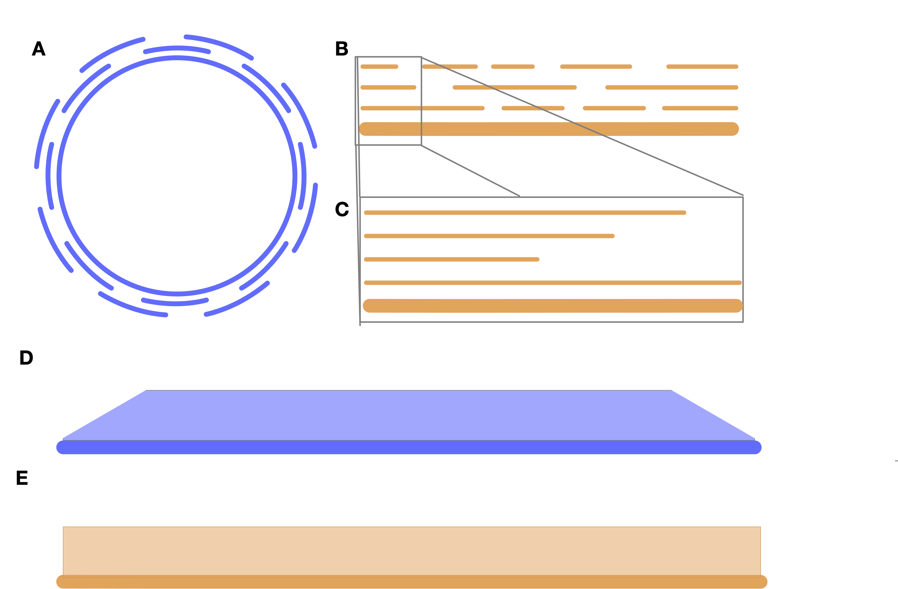
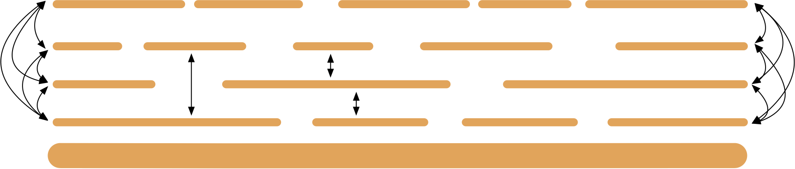

# How to find borgs in nanopore data 

Daniel Giguere 

**tl;dr at [bottom](https://github.com/dgiguer/how-to-find-nanopore-borgs#summary-tldr)**

### Background 

Borgs are double stranded linear DNA elements recently proposed by [@themicrobeguy and others](https://twitter.com/themicrobeguy/status/1414202238537449473). They were identified using short-read metagenomic data - **so how can we find them using long-read metagenomic nanopore data?** Do an **all-vs-all alignment** for all long reads, **remove alignments where less than 90% of the read actually aligns**, then **create a network graph** of target and query read names. Each cluster of reads represents the end of a linear dsDNA element. The number of reads in the cluster approximates the read depth for that element. If this "end" of a linear element has reasonably high coverage and was already assembled into a long linear contig during your metagenome assembly, **congratulations! you found a linear dsDNA element that may be a borg**. Now you just need to make sure that it's not a eukaryotic chromosome, mega-phage, or other dsDNA element. 

### Filter alignments by query coverage

Circular dsDNA elements will have filtered coverage that tails off at the beginning and end of the fasta file because a read that truly aligns to both sides will be broken into two alignments, resulting in two reads with around 50% read alignment (more or less). This is not the case for linear dsDNA elements because the DNA fragments all start at roughly the same spot. If you filter your read alignments by retaining only those with > 90% query coverage, the coverage depth plot will look like D) for circular elements in blue and E) for linear elements in orange. 



### Create a network graph 

Notice how in B) and C) that long reads all end at the same spot? That means they will align to all other reads that start at the "end" of a dsDNA linear with (theoretically) 100% query coverage. These are retained by our previous filtering step. This should only occur throughout the rest of the genome by random chance. So if you have ~ 100X sequencing coverage, you should have a group of about 100 reads that all align to each other with near 100% query coverage. We know this because we have done this to find telomere ends in a eukaryotic genome assembly (Pre-print here, paper submitted), and have completed circular bacterial genomes directly from metagenomes (pre-print). In the eukaryotic genome assembly, we found the number of read each cluster **approximated the true number of chromosomes in the microalgae, because it allowed us to estimate the number of linear dsDNA "ends".** We found about 100 clusters, which conveniently equals 25 chromosomes * 2 telomeres per chromosome * 2 haplotyes. **This clusters represent thee "end" of any linear dsDNA element**, including small linear dsDNA viral genomes, eukaryotic chromosomes, and most importantly, **borgs**. This should allow you to identify borg candidate contigs **in a sequence- and annotation-independent manner**. The network graph is shown below in the context of overlapping read coverage, where the ends of a linear dsDNA element have a very strong signal of reads that all map 100% to each other (either query or target coverage), whereas this occurs infrequently in the middle of the chromosome.



### Summary, tl;dr 

You can disriminate between circular and linear dsDNA elements by visualizing coverage depth pre-filtered with a minimum % read alignment. You can also identify all "ends" of linear dsDNA elements by creating a network graph of all-vs-all alignment output (pre-filtered by high query coverage), where each cluster is actually a group of reads that aligns to all other reads in the group. Combining both allows you to find all ends of linear dsDNA elements with high enough coverage - these are your borg candidates!

**Want to re-basecall a nanopore dataset in high-accuracy mode? Check out [www.flowgenomics.com](www.flowgenomics.com).**

[Want to collaborate? Click here to email me.](mailto:dgiguer@uwo.ca)

### The work flow 

This is section is intended as guidance rather than actually providing a script. 

Use minimap2 to do all-vs-all read alignment. 

```
# output to paf for network graph of reads. use longer reads only (minimum 10 kb)
minimap2 -x ava-ont -t 40 reads_10kb.fastq.gz reads_10kb.fastq.gz > read_alignments.paf
```

You can filter reads by query coverage using a tool Alec and I developed called [gerenuq[(wwww.github.com/abahcheli/gerenuq). 

```
# retain only read alignments with 90% query coverage. this also reduces file size for R
gerenuq -i read_alignments.paf -m 0.9 -o read_alignments_filtered.paf
```

Now bring this in to R for the network graph using the iGraph package. 

```
R

d <- read.table("read_alignments_filtered.paf", sep = "\t", header= FALSE, row.names=NULL)

# 

library(igraph)

d.sub <- data.frame(from=d$V1, to=d$V6)


g <- graph_from_data_frame(d.sub)
clu <- components(g)

# show individual groups of reads 
groups(clu)

# plot a histogram of reads to see if high coverage linear dsDNA exist.  
final <- vector()

for (i in seq(length(groups(clu)))) {
    
    final[i] <- length(groups(clu)[[i]])
    
}

hist(final, breaks = 99)
```

If high coverage groups exist, these will represent ends of linear dsDNA elements. Find the contig in your assembly by mapping a read or two to it, then verify that it's a borg using the criteria described in [@themicrobeguy](https://twitter.com/themicrobeguy)'s pre-print!
 

